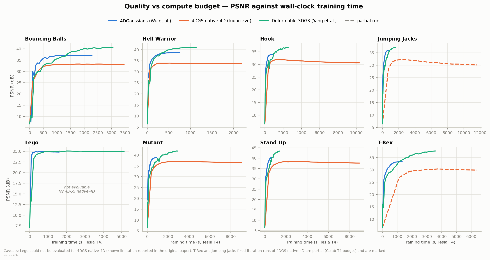
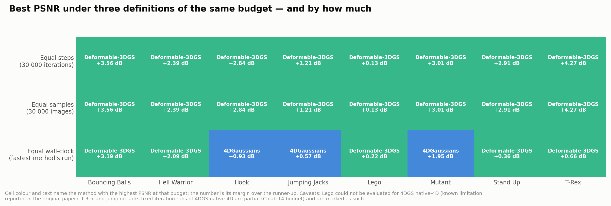

# Dynamic Gaussian Splatting Benchmark on monocular D-NeRF

A controlled, reproducible comparison of three dynamic 3D Gaussian Splatting methods on the eight scenes of the monocular D-NeRF synthetic dataset, run entirely on a free-tier Google Colab **Tesla T4**.

| Method | Paper | Official code | Notebook |
|---|---|---|---|
| **Deformable-3DGS** | Yang et al., CVPR 2024 ([arXiv](https://arxiv.org/abs/2309.13101)) | [ingra14m/Deformable-3D-Gaussians](https://github.com/ingra14m/Deformable-3D-Gaussians) | [`01_deformable_3dgs_dnerf.ipynb`](notebooks/01_deformable_3dgs_dnerf.ipynb) |
| **4DGaussians / HexPlane** | Wu et al., CVPR 2024 ([arXiv](https://arxiv.org/abs/2310.08528)) | [hustvl/4DGaussians](https://github.com/hustvl/4DGaussians) | [`02_4dgaussians_wu_dnerf.ipynb`](notebooks/02_4dgaussians_wu_dnerf.ipynb) |
| **4DGS, native 4D primitives** | Yang et al., ICLR 2024 ([arXiv](https://arxiv.org/abs/2310.10642)) | [fudan-zvg/4d-gaussian-splatting](https://github.com/fudan-zvg/4d-gaussian-splatting) | [`03_4dgs_native4d_fudan_dnerf.ipynb`](notebooks/03_4dgs_native4d_fudan_dnerf.ipynb) |

Each method is trained with its **official training code**. The only modifications are a monitor attached to the repository's own `training_report(...)` hook, configuration overrides needed to align the protocol (budget, resolution, background, per-scene configs) and environment fixes for the current Colab image, all listed in [docs/METHODOLOGY.md](docs/METHODOLOGY.md). The monitor records, during training, PSNR, SSIM, LPIPS (VGG), evaluation L1, training time net of the measurement overhead, iterations, images seen, number of Gaussians, peak VRAM and model storage. **46 evaluable training runs and 1 177 evaluation points** are included in this repository as raw JSON.

**Interactive results dashboard:** [`results/analysis/benchmark_dashboard.html`](results/analysis/benchmark_dashboard.html) (self-contained: download it and open it in a browser, it works offline).

> **AI disclosure.** This repository and part of the code used to extract the metrics (the benchmark monitor injected into each training loop, the per-scene preparation code, the analysis pipeline in `results/analysis/scripts/`) were generated with AI assistance (Anthropic's Claude), starting from the code of the official repository of each method. The training code of each method is the official one, cloned at run time and modified only as described above, and every number reported here comes from real training runs whose raw logs are included in `results/`. The documentation, also AI-assisted, was checked against the raw data and the original papers.

## Two protocols

* **Protocol A, equal iterations.** Every method trains for 30 000 optimisation steps (for 4DGaussians: 3 000 coarse + 27 000 fine), metrics sampled every 1 000 steps. *At equal budget, which method reconstructs best?*
* **Protocol B, equal quality.** Training stops as soon as the evaluation L1 reaches a per-scene target common to the three methods (two consecutive hits, sampled every 30 s); costs are read at the **first crossing**. *What does the same reconstruction quality cost?*

All methods are evaluated at 800×800 on the full 20-view test split, on a black background, with LPIPS-VGG. Why each of these conventions was needed is explained in [docs/METHODOLOGY.md](docs/METHODOLOGY.md).

## Key results

Means over the five scenes completed by all three methods (bouncingballs, hellwarrior, hook, mutant, standup).

**Protocol A, 30 000 iterations (best value over the run):**

| Method | PSNR ↑ | SSIM ↑ | LPIPS ↓ | training time | s / 1 000 it | peak VRAM |
|---|---|---|---|---|---|---|
| Deformable-3DGS | **40.76** | **0.991** | **0.014** | 36.7 min | 73 | 3 331 MB |
| 4DGaussians | 37.81 | 0.983 | 0.027 | **18.8 min** | **38** | **1 639 MB** |
| 4DGS native-4D | 34.92 | 0.974 | 0.035 | 113 min | 226 | 2 268 MB |

**Protocol B, same L1 target, at the first crossing:**

| Method | iterations | images seen | time | PSNR | model on disk |
|---|---|---|---|---|---|
| 4DGS native-4D | **5 258** | 24 598 | 15.97 min | 34.44 | 70.0 MB |
| 4DGaussians | 8 315 | **8 315** | **3.49 min** | 33.99 | 17.9 MB |
| Deformable-3DGS | 8 302 | 8 302 | 6.71 min | 34.36 | **12.2 MB** |

* **Deformable-3DGS** has the best PSNR, SSIM and LPIPS on all eight scenes, by about 3 dB, at twice the training time of 4DGaussians and the highest VRAM.
* **4DGaussians** offers the best quality/cost ratio: second in quality, half the training time, the lowest VRAM and the fastest time to a fixed quality target.
* **4DGS with native 4D primitives** needs the fewest optimisation steps, but only because of its larger per-scene batches: it consumes about 3× the training samples and 4.6× the time of 4DGaussians, and its model takes 3.9× the disk of 4DGaussians (5.7× that of Deformable-3DGS). It is also the only method whose test quality degrades after an early peak (−0.62 dB on average), a temporal overfitting that is strongest on the scenes trained with large batches.
* **The practical constraint is time, not memory**: peak VRAM never exceeded 5.1 GB of the 16 GB of the T4.
* The ranking depends on how "equal budget" is defined: equal steps and equal samples agree, equal wall-clock time lets 4DGaussians win on three scenes.





Full discussion: [docs/RESULTS.md](docs/RESULTS.md).

**Caveats.** lego cannot be evaluated for 4DGS native-4D (its run terminates without producing any evaluation entry); its Protocol A runs on trex and jumpingjacks are partial (stopped at 6 000 and 15 000 iterations on the T4, after their peak). One run per configuration, without repeated seeds.

## Repository structure

```
.
├── notebooks/                      one self-contained Colab notebook per method
├── docs/
│   ├── METHODOLOGY.md              instrumentation, aligned conventions, protocols, limitations
│   ├── PROTOCOL_B_CALIBRATION.md   derivation of the per-scene L1 targets
│   ├── RESULTS.md                  results of both protocols and conclusions
│   ├── REFERENCES.md               papers and BibTeX
│   └── papers_comparison_table.pdf comparison of the five dynamic methods studied
└── results/
    ├── deformablegaussian/         raw benchmark JSON, one folder per run
    ├── 4dgaussian_output/          (<scene>_iters*/ = Protocol A, <scene>_loss*/ = Protocol B)
    ├── 4dgs_fudan_output/
    └── analysis/
        ├── README_analysis.md      full write-up, results tables and the 7 figures kept here
        ├── benchmark_dashboard.html   interactive, self-contained (its own charts, data inlined)
        ├── dashboard_data.json
        ├── figures/                7 figures backing specific claims above; run_all.sh regenerates
        │                           the full 46-figure set locally from the raw JSON
        ├── tables/                 curves_all.csv, runs_summary.csv, per-protocol tables
        └── scripts/                pipeline: raw JSON -> tables, figures, dashboard
```

## Reproducing the results

### 1. Training (Google Colab)

1. Open a notebook in Colab (the badge at the top of each notebook, or *File → Upload notebook*) and select a **T4 GPU** runtime.
2. Edit only cell **0.1**: storage (`STORAGE_MODE`), `RUN_MODE` (`"single"` or `"loop"`), scenes and protocol (`TRAINING_MODE`).
3. Run **Part 1** top to bottom. Each run writes `<run>/benchmark/benchmark_<protocol>.json` to Google Drive; an interrupted loop resumes where it stopped when the cell is re-run.

Workflow used for this study: Protocol A on all scenes with all three notebooks, then calibration of the Protocol B targets (cell 4.3 and [docs/PROTOCOL_B_CALIBRATION.md](docs/PROTOCOL_B_CALIBRATION.md)), then Protocol B. The calibrated targets are already in the notebooks, which ship with `TRAINING_MODE = "iterations"`; set it to `"target_eval_loss"` for Protocol B.

**Part 2** of each notebook (rendering and final metrics, a WebSocket real-time viewer, video export) must not be run during a training loop.

### 2. Analysis (local)

```bash
pip install numpy pandas matplotlib
cd results/analysis/scripts
./run_all.sh
```

This regenerates every CSV table, the 46 figures (PNG and PDF) and `dashboard_data.json` from the raw JSON, then rebuilds the dashboard. Note that `run_all.sh` writes a dashboard that loads Chart.js from a CDN; the committed one embeds it (`python3 build_dashboard.py --inline-lib chart.umd.js`). See [results/analysis/scripts/README.md](results/analysis/scripts/README.md), including how to add a new method or scene.

## Acknowledgements

This work was carried out as an independent research project at Politecnico di Milano. Thanks to Prof. Simona Perotto (Politecnico di Milano) for academic supervision and to Leonardo Locatelli (Adapta Studio) for the collaboration.

The benchmark builds on the official implementations listed above and on the D-NeRF dataset (Pumarola et al., CVPR 2021). Their code is not redistributed here: the notebooks clone it at run time, and it remains under the respective licences. The `render.py` written by the fudan-zvg notebook derives from the Inria 3D Gaussian Splatting code and keeps its original copyright header.
