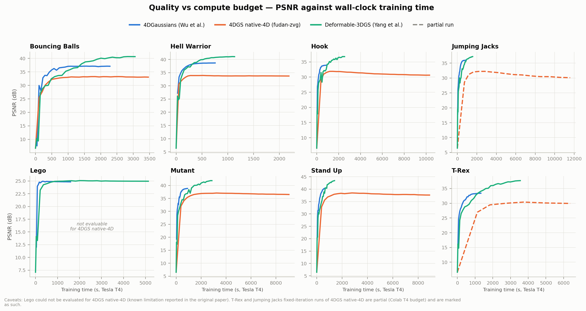
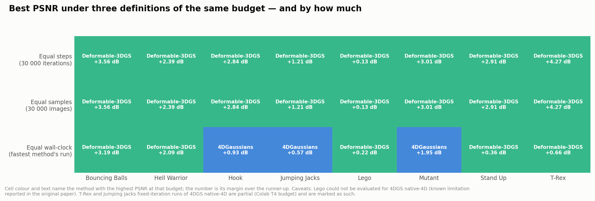

# Dynamic Gaussian Splatting Benchmark

A controlled, reproducible comparison of dynamic 3D Gaussian Splatting methods under one measurement protocol, on a single cloud GPU. Two studies share the same monitor and the same metrics:

* **Monocular study** — three methods on the eight scenes of the D-NeRF synthetic dataset, on a free-tier Google Colab **Tesla T4**. **Complete**: 46 evaluable runs, 1 177 evaluation points, results below.
* **Multi-view study** — three methods on the six scenes of *Neural 3D Video Synthesis from Multi-View Video* (N3DV). **Notebooks and protocol in place, no run made yet** ([jump](#multi-view-study-neural-3d-video)).

## Monocular study (D-NeRF)

Three dynamic 3D Gaussian Splatting methods on the eight scenes of the monocular D-NeRF synthetic dataset.

| Method | Paper | Official code | Notebook |
|---|---|---|---|
| **Deformable-3DGS** | Yang et al., CVPR 2024 ([arXiv](https://arxiv.org/abs/2309.13101)) | [ingra14m/Deformable-3D-Gaussians](https://github.com/ingra14m/Deformable-3D-Gaussians) | [`01_deformable_3dgs_dnerf.ipynb`](notebooks/01_deformable_3dgs_dnerf.ipynb) |
| **4DGaussians / HexPlane** | Wu et al., CVPR 2024 ([arXiv](https://arxiv.org/abs/2310.08528)) | [hustvl/4DGaussians](https://github.com/hustvl/4DGaussians) | [`02_4dgaussians_wu_dnerf.ipynb`](notebooks/02_4dgaussians_wu_dnerf.ipynb) |
| **4DGS, native 4D primitives** | Yang et al., ICLR 2024 ([arXiv](https://arxiv.org/abs/2310.10642)) | [fudan-zvg/4d-gaussian-splatting](https://github.com/fudan-zvg/4d-gaussian-splatting) | [`03_4dgs_native4d_fudan_dnerf.ipynb`](notebooks/03_4dgs_native4d_fudan_dnerf.ipynb) |

Each method is trained with its **official training code**. The only modifications are a monitor attached to the repository's own `training_report(...)` hook, configuration overrides needed to align the protocol (budget, resolution, background, per-scene configs) and environment fixes for the current Colab image, all listed in [docs/METHODOLOGY.md](docs/METHODOLOGY.md). The monitor records, during training, PSNR, SSIM, LPIPS (VGG), evaluation L1, training time net of the measurement overhead, iterations, images seen, number of Gaussians, peak VRAM and model storage. **46 evaluable training runs and 1 177 evaluation points** are included in this repository as raw JSON.

**Interactive results dashboard:** [`results/analysis/benchmark_dashboard.html`](results/analysis/benchmark_dashboard.html) (self-contained: download it and open it in a browser, it works offline).

> **AI disclosure.** This repository and part of the code used to extract the metrics (the benchmark monitor injected into each training loop, the per-scene preparation code, the analysis pipeline in `results/analysis/scripts/`) were generated with AI assistance (Anthropic's Claude), starting from the code of the official repository of each method. The training code of each method is the official one, cloned at run time and modified only as described above, and every number reported here comes from real training runs whose raw logs are included in `results/`. The documentation, also AI-assisted, was checked against the raw data and the original papers.

## Two protocols

* **Protocol A, equal iterations.** Every method trains for 30 000 optimisation steps (for 4DGaussians: 3 000 coarse + 27 000 fine), metrics sampled every 1 000 steps. *At equal budget, which method reconstructs best?*
* **Protocol B, equal quality.** Training stops as soon as the evaluation L1 reaches a per-scene target common to the three methods (two consecutive hits, sampled every 30 s); costs are read at the **first crossing**. *What does the same reconstruction quality cost?*

All methods are evaluated at 800×800 on the full 20-view test split, on a black background, with LPIPS-VGG. Why each of these conventions was needed is explained in [docs/METHODOLOGY.md](docs/METHODOLOGY.md).

## Key results

Means over the five scenes completed by all three methods (bouncingballs, hellwarrior, hook, mutant, standup).

**Protocol A, 30 000 iterations (best value over the run):**

| Method | PSNR ↑ | SSIM ↑ | LPIPS ↓ | training time | s / 1 000 it | peak VRAM |
|---|---|---|---|---|---|---|
| Deformable-3DGS | **40.76** | **0.991** | **0.014** | 36.7 min | 73 | 3 331 MB |
| 4DGaussians | 37.81 | 0.983 | 0.027 | **18.8 min** | **38** | **1 639 MB** |
| 4DGS native-4D | 34.92 | 0.974 | 0.035 | 113 min | 226 | 2 268 MB |

**Protocol B, same L1 target, at the first crossing:**

| Method | iterations | images seen | time | PSNR | model on disk |
|---|---|---|---|---|---|
| 4DGS native-4D | **5 258** | 24 598 | 15.97 min | 34.44 | 70.0 MB |
| 4DGaussians | 8 315 | **8 315** | **3.49 min** | 33.99 | 17.9 MB |
| Deformable-3DGS | 8 302 | 8 302 | 6.71 min | 34.36 | **12.2 MB** |

* **Deformable-3DGS** has the best PSNR, SSIM and LPIPS on all eight scenes, by about 3 dB, at twice the training time of 4DGaussians and the highest VRAM.
* **4DGaussians** offers the best quality/cost ratio: second in quality, half the training time, the lowest VRAM and the fastest time to a fixed quality target.
* **4DGS with native 4D primitives** needs the fewest optimisation steps, but only because of its larger per-scene batches: it consumes about 3× the training samples and 4.6× the time of 4DGaussians, and its model takes 3.9× the disk of 4DGaussians (5.7× that of Deformable-3DGS). It is also the only method whose test quality degrades after an early peak (−0.62 dB on average), a temporal overfitting that is strongest on the scenes trained with large batches.
* **The practical constraint is time, not memory**: peak VRAM never exceeded 5.1 GB of the 16 GB of the T4.
* The ranking depends on how "equal budget" is defined: equal steps and equal samples agree, equal wall-clock time lets 4DGaussians win on three scenes.





Full discussion: [docs/RESULTS.md](docs/RESULTS.md).

**Caveats.** lego cannot be evaluated for 4DGS native-4D (its run terminates without producing any evaluation entry); its Protocol A runs on trex and jumpingjacks are partial (stopped at 6 000 and 15 000 iterations on the T4, after their peak). One run per configuration, without repeated seeds.

## Repository structure

```
.
├── notebooks/                      one self-contained notebook per method and study
│   ├── 01-03                       monocular D-NeRF
│   └── 05-07                       multi-view N3DV
├── docs/
│   ├── METHODOLOGY.md              monocular: instrumentation, aligned conventions, protocols
│   ├── METHODOLOGY_MULTIVIEW.md    multi-view: the same, plus what could and could not be equalised
│   ├── OPEN_DECISIONS_MULTIVIEW.md the choices behind the multi-view protocol: taken, and still open
│   ├── DISCLOSURES_MULTIVIEW.md    what to be careful about when reading the multi-view results
│   ├── PROTOCOL_B_CALIBRATION.md   derivation of the per-scene L1 targets (both studies)
│   ├── RESULTS.md                  results of both protocols and conclusions
│   ├── REFERENCES.md               papers and BibTeX
│   └── papers_comparison_table.pdf comparison of the five dynamic methods studied
├── scripts/
│   ├── run_benchmark.py            run Part 1 of a notebook headlessly, over SSH
│   └── estimate_gpu_hours.py       turn short smoke runs into a GPU-hours estimate
└── results/
    ├── deformablegaussian/         raw benchmark JSON, one folder per run
    ├── 4dgaussian_output/          (<scene>_iters*/ = Protocol A, <scene>_loss*/ = Protocol B)
    ├── 4dgs_fudan_output/
    ├── n3dv/                       data root of the multi-view study (empty: no run yet)
    └── analysis/
        ├── README_analysis.md      full write-up, results tables and the 7 figures kept here
        ├── benchmark_dashboard.html   interactive, self-contained (its own charts, data inlined)
        ├── dashboard_data.json
        ├── figures/                7 figures backing specific claims above; run_all.sh regenerates
        │                           the full 46-figure set locally from the raw JSON
        ├── tables/                 curves_all.csv, runs_summary.csv, per-protocol tables
        └── scripts/                pipeline: raw JSON -> tables, figures, dashboard
                                    (study.py selects which study, via GS_STUDY)
```

## Reproducing the results

### 1. Training (Google Colab)

1. Open a notebook in Colab (the badge at the top of each notebook, or *File → Upload notebook*) and select a **T4 GPU** runtime.
2. Edit only cell **0.1**: storage (`STORAGE_MODE`), `RUN_MODE` (`"single"` or `"loop"`), scenes and protocol (`TRAINING_MODE`).
3. Run **Part 1** top to bottom. Each run writes `<run>/benchmark/benchmark_<protocol>.json` to Google Drive; an interrupted loop resumes where it stopped when the cell is re-run.

Workflow used for this study: Protocol A on all scenes with all three notebooks, then calibration of the Protocol B targets (cell 4.3 and [docs/PROTOCOL_B_CALIBRATION.md](docs/PROTOCOL_B_CALIBRATION.md)), then Protocol B. The calibrated targets are already in the notebooks, which ship with `TRAINING_MODE = "iterations"`; set it to `"target_eval_loss"` for Protocol B.

**Part 2** of each notebook (rendering and final metrics, a WebSocket real-time viewer, video export) must not be run during a training loop.

### 2. Analysis (local)

```bash
pip install numpy pandas matplotlib
cd results/analysis/scripts
./run_all.sh
```

This regenerates every CSV table, the 46 figures (PNG and PDF) and `dashboard_data.json` from the raw JSON, then rebuilds the dashboard. Note that `run_all.sh` writes a dashboard that loads Chart.js from a CDN; the committed one embeds it (`python3 build_dashboard.py --inline-lib chart.umd.js`). See [results/analysis/scripts/README.md](results/analysis/scripts/README.md), including how to add a new method or scene.

## Multi-view study (Neural 3D Video)

The monocular study covers only methods that accept single-camera input. The benchmark is extended to **N3DV**: about 20 synchronised cameras, `cam00` held out for testing, 1352×1014, six scenes of 300 frames each.

| Method | Paper | Official code | Notebook |
|---|---|---|---|
| **4DGaussians / HexPlane** | Wu et al., CVPR 2024 ([arXiv](https://arxiv.org/abs/2310.08528)) | [hustvl/4DGaussians](https://github.com/hustvl/4DGaussians) | [`05_4dgaussians_wu_n3dv.ipynb`](notebooks/05_4dgaussians_wu_n3dv.ipynb) |
| **4DGS, native 4D primitives** | Yang et al., ICLR 2024 ([arXiv](https://arxiv.org/abs/2310.10642)) | [fudan-zvg/4d-gaussian-splatting](https://github.com/fudan-zvg/4d-gaussian-splatting) | [`06_4dgs_native4d_fudan_n3dv.ipynb`](notebooks/06_4dgs_native4d_fudan_n3dv.ipynb) |
| **Spacetime Gaussians**, `lite` and `full` | Li et al., CVPR 2024 ([arXiv](https://arxiv.org/abs/2312.16812)) | [oppo-us-research/SpacetimeGaussians](https://github.com/oppo-us-research/SpacetimeGaussians) | [`07_spacetime_gaussians_li_n3dv.ipynb`](notebooks/07_spacetime_gaussians_li_n3dv.ipynb) |

**Same monitor, same metrics, same analysis.** The core of the benchmark monitor is **byte-identical in the three notebooks** — it is delimited by explicit markers and the check is part of the test suite — and everything repository-specific lives in a glue block behind ten named functions. Spacetime Gaussians has no `training_report(...)` to wrap: its loop calls a narrower per-iteration function, which the monitor wraps instead, reading the rest of the loop state from the calling frame.

**Two windows.** The **main study uses all 300 frames**, which is what the three papers report, so the results can be checked against the published numbers. Spacetime Gaussians covers a sequence in 50-frame blocks by construction, so there it is six independent models per scene, merged into one result as its paper does. A **secondary study uses the first 50 frames**; it is cheaper, every method is a single model in it, and it is where Protocol B is run.

**Protocol A is each method's official budget, not a common one.** 3 000 + 14 000 steps for 4DGaussians, 30 000 for the other two, with the official per-scene batch sizes, and about 30 samples of the metrics per run. The monocular study showed that a step is not a common unit of work; here the methods are compared on images seen and on training time. Spacetime Gaussians is read both at the end of its run and at the snapshot its own configs evaluate (25 000 steps on four scenes, 10 000 and 12 000 on the other two).

**A fourth method was set aside.** Dynamic 3D Gaussians (Luiten et al., 3DV 2024) was part of this study and was set aside before any run: in the only published N3DV comparison (Spacetime Gaussians paper, Appendix B, Table 6) it is last in quality (30.67 dB PSNR, 0.099 LPIPS against 31.59–32.05 dB and 0.044–0.047) with a model of 2.7 GB against 100–200 MB, and first only in rendering speed, which this benchmark does not measure. It also costs a fixed number of steps per frame, which had forced a 50-frame main window. The reasoning is in [docs/METHODOLOGY_MULTIVIEW.md](docs/METHODOLOGY_MULTIVIEW.md) §1.1.

**Decisions.** The choices behind this protocol are written up, with their trade-offs and sources, in [docs/OPEN_DECISIONS_MULTIVIEW.md](docs/OPEN_DECISIONS_MULTIVIEW.md). Still open: which GPU the whole study runs on (training time and peak VRAM are measured metrics), how to carry Protocol B to the 300-frame window, whether to add a temporally subsampled window, and the LPIPS backend. What needs no decision but does need care when reading the numbers is in [docs/DISCLOSURES_MULTIVIEW.md](docs/DISCLOSURES_MULTIVIEW.md).

**Homogeneity.** Eight differences between the methods were removed (evaluation resolution, test split, temporal window, initial point cloud, LPIPS backend, background convention, metric definitions, sampling density) and eight could only be declared (iteration budget, batch size, model variant, models per scene, environment map, per-frame initialisation, storage definitions, densification hyper-parameters). The full table, with the reason for each, is in [docs/METHODOLOGY_MULTIVIEW.md](docs/METHODOLOGY_MULTIVIEW.md) §4.

### Running on a cloud GPU over SSH

The notebooks detect where they are running — a [lightning.ai](https://lightning.ai) Studio, Google Colab, or any Linux machine with an NVIDIA GPU — and derive every path from one working directory. Every setting of cell 0.1 can be overridden with a `BENCH_<NAME>` environment variable, which `scripts/run_benchmark.py` sets from `--set NAME=VALUE`. A run can therefore be launched and resumed over SSH with no browser:

```bash
python3 scripts/run_benchmark.py notebooks/05_4dgaussians_wu_n3dv.ipynb \
    --set RUN_MODE=loop --set TRAINING_MODE=iterations
```

That executes Part 1 of the notebook (Part 2 renders and would compete for the GPU), trains the scenes one after another on the 300-frame window, and saves the executed notebook under `logs/`. Each finished result is copied with `rclone` (remote `gdrive` by default) to **one shared Google Drive folder**, `dgs-benchmark-n3dv`, which gathers the JSON of all the methods in the layout the analysis pipeline reads. The loop is resumable: rerunning the same command skips the scenes that already finished.

The other runs of the study are the same command with one more setting:

```bash
--set NUM_FRAMES=50                 # the 50-frame study (default: 300)
--set STG_MODEL=ours_full           # notebook 07: the second variant (default: ours_lite)
--set TRAINING_MODE=target_eval_loss   # Protocol B, on the 50-frame window, once calibrated
```

Rules that keep the measurements valid:

* **one GPU type for the whole study**, and **one run at a time** on it, because training time and peak VRAM are measured metrics and peak VRAM is read for the whole device;
* Spacetime Gaussians' README asks for 24 GB of GPU memory on N3DV; on a 16 GB GPU it needs `--set EXTRA_TRAIN_ARGS="--gtisint8 1"` (ground-truth images held on the GPU as 8-bit integers, lossless for PNG frames);
* run notebook `05` first: it builds the COLMAP cache that `06` reuses;
* to let the second Spacetime Gaussians variant reuse the per-frame COLMAP models of the first, run the first with `--set DELETE_FRAMES_AFTER_TRAIN=false`;
* use `tmux` (or similar) so that a run survives a dropped SSH connection.

**Start with a smoke test.** Nothing here has run on a GPU yet. A smoke test is a normal run of one scene, stopped early and written to its own folder:

```bash
python3 scripts/run_benchmark.py notebooks/05_4dgaussians_wu_n3dv.ipynb \
    --set RUN_MODE=single --set SCENE=sear_steak --set NUM_FRAMES=50 \
    --set MAX_ITERATIONS=2000 --set EVAL_EVERY_N_ITERS=500 \
    --set ROOT_NAME=dgs-smoke --set STORAGE_MODE=local

python3 scripts/estimate_gpu_hours.py <workdir>/bench_out/dgs-smoke
```

The second command prints what was measured (seconds per step, seconds per evaluation, peak VRAM, preparation time, disk per scene) and the GPU hours the full study would take, per method and window. What to run and how far to trust the estimate is in [docs/OPEN_DECISIONS_MULTIVIEW.md](docs/OPEN_DECISIONS_MULTIVIEW.md#the-smoke-test).

Once the results are in `results/n3dv/`:

```bash
cd results/analysis/scripts
GS_ROOT="$(pwd)/../../n3dv" GS_STUDY=n3dv ./run_all.sh        # main study, 300 frames
GS_ROOT="$(pwd)/../../n3dv" GS_STUDY=n3dv_f50 ./run_all.sh    # secondary study, 50 frames
```

writes the multi-view tables, figures and dashboard under `results/n3dv/analysis/` (and `analysis_f50/` for the 50-frame study), separately from the monocular ones.

**Status.** No multi-view training run has been made yet: `results/n3dv/` is empty, the Protocol B targets ship as `None` (they are derived from Protocol A results, which do not exist yet), and there is no multi-view results table.

## Acknowledgements

This work was carried out as an independent research project at Politecnico di Milano. Thanks to Prof. Simona Perotto (Politecnico di Milano) for academic supervision and to Leonardo Locatelli (Adapta Studio) for the collaboration.

The benchmark builds on the official implementations listed above, on the D-NeRF dataset (Pumarola et al., CVPR 2021) and on the Neural 3D Video dataset (Li et al., CVPR 2022, CC-BY-NC 4.0). Their code is not redistributed here: the notebooks clone it at run time, and it remains under the respective licences. The `render.py` written by the fudan-zvg notebook derives from the Inria 3D Gaussian Splatting code and keeps its original copyright header.
